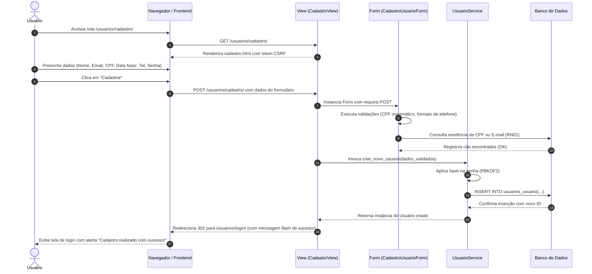
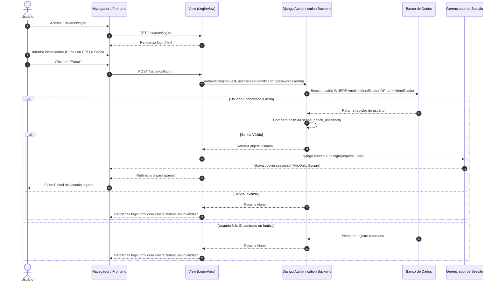
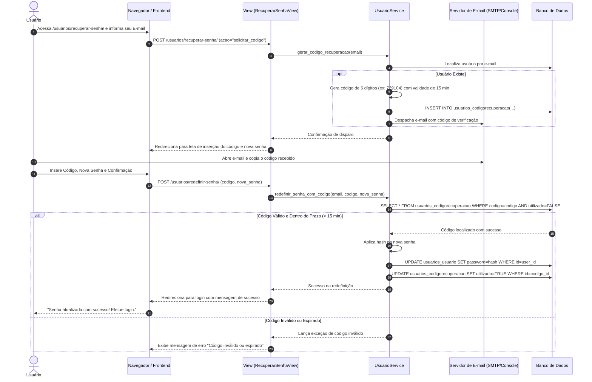
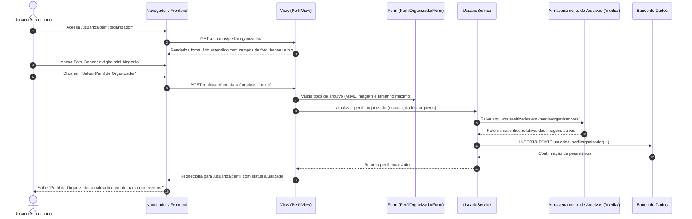

# Diagramas de Sequência — Fluxos de Interação

| Metadado | Detalhe |
|---|---|
| **Projeto** | SGIE — Sistema de Gestão de Inscrições e Eventos Universitários |
| **Módulo** | Usuários, Autenticação e Permissões (Squad 1) |
| **Responsável pela Modelagem** | Luciano de Souza |
| **Líder da Squad** | Luciano de Souza |
| **Data de Criação** | 21 de setembro de 2026 |
| **Versão** | 1.0.0 |
| **Status** | Homologado para Implementação |

---

## 1. Introdução

Este documento formaliza a ordem cronológica e a troca de mensagens entre os componentes do sistema (Usuário, Navegador, Controladores Django, Camada de Negócio e Banco de Dados).

Os diagramas expandem a modelagem inicial registrada em `diagrama_sequencia_cadastro_login.pdf` para cobrir os fluxos completos de Cadastro, Login Tradicional, Autenticação Google, Recuperação de Acesso e Atualização de Perfil.

---

## 2. Diagrama 1: Cadastro de Usuário (RF01)

Representa o preenchimento do formulário padrão, validação de unicidade de CPF/E-mail (`RN01`) e persistência segura no banco de dados.

---

## 3. Diagrama 2: Autenticação Tradicional — Login por E-mail ou CPF (RF02)

Demonstra a resolução de login híbrido suportando tanto e-mail quanto CPF no mesmo campo de entrada.

---

## 4. Diagrama 3: Fluxo de Recuperação de Acesso por Código (RF03)

Ilustra o envio do código de 6 dígitos via e-mail e a redefinição subsequente de credenciais.

---

## 5. Diagrama 4: Atualização de Perfil de Organizador (RF04, RN04)

Evidencia a expansão de um participante comum para organizador institucional através de upload de mídia e mini-bio.

