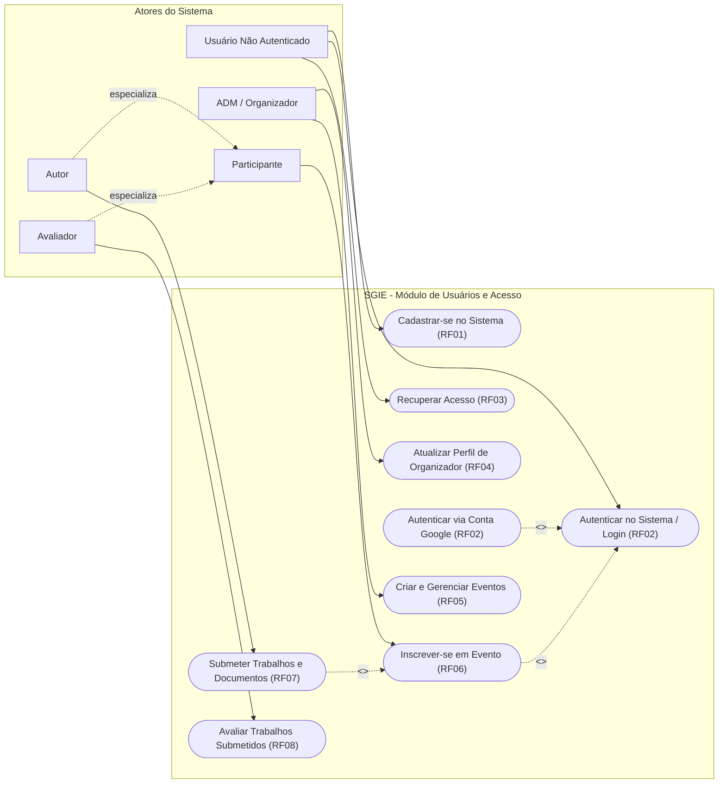

# Especificação e Diagrama de Casos de Uso

| Metadado | Detalhe |
|---|---|
| **Projeto** | SGIE — Sistema de Gestão de Inscrições e Eventos Universitários |
| **Módulo** | Usuários, Autenticação e Permissões (Squad 1) |
| **Responsável pela Modelagem** | Letícia Vitorino |
| **Líder da Squad** | Luciano de Souza |
| **Data de Criação** | 21 de setembro de 2026 |
| **Versão** | 1.0.0 |
| **Status** | Homologado para Implementação |

---

## 1. Introdução

Este artefato documenta a modelagem comportamental de casos de uso do **Módulo de Usuários, Autenticação e Permissões**, formalizando as interações entre os atores (humanos ou sistemas externos) e as funcionalidades providas pelo SGIE.

A modelagem segue a especificação originalmente rascunhada em `diagrama_casos_uso.pdf`, estabelecendo relações de herança entre atores, pontos de extensão (`<<extend>>`) e inclusões obrigatórias (`<<include>>`).

---

## 2. Atores do Sistema

1. **Usuário Não Autenticado (Visitante)**: Qualquer indivíduo que acessa o sistema sem estar logado. Pode criar uma conta, solicitar recuperação de acesso ou autenticar-se.
2. **Participante**: Usuário base cadastrado e autenticado. Pode visualizar eventos, gerenciar seu perfil básico e solicitar inscrições em eventos em múltiplos papéis.
3. **Autor**: Especialização do Participante em determinado evento. Possui homologação para submeter resumos, artigos, pesquisas e propostas de oficinas/workshops.
4. **Avaliador**: Especialização do Participante em determinado evento. Integra a banca científica ou comitê de avaliação para analisar submissões e atribuir pareceres/notas.
5. **Administrador / Organizador**: Usuário com perfil estendido que detém permissões para criar, editar, configurar e gerenciar eventos, atividades e equipes operacionais.

---

## 3. Diagrama Geral de Casos de Uso (Mermaid)

---

## 4. Especificação Detalhada dos Casos de Uso

### UC01 – Cadastrar-se no Sistema
- **Ator Primário**: Usuário Não Autenticado.
- **Requisito Associado**: `RF01`, `RN01`, `RN06`.
- **Pré-condições**: Usuário possui CPF válido e e-mail acessível.
- **Pós-condições**: Conta criada com credenciais criptografadas e pronta para autenticação.
- **Fluxo Principal**:
  1. O usuário acessa a opção "Criar Conta".
  2. O sistema exibe o formulário solicitando Nome Completo, E-mail, CPF, Data de Nascimento, Telefone e Senha.
  3. O usuário preenche os campos e confirma a submissão.
  4. O sistema valida os campos, valida o CPF matematicamente e certifica a unicidade de CPF e e-mail.
  5. O sistema registra o usuário e redireciona para o login com mensagem de sucesso.
- **Fluxos de Exceção**:
  - *4a. CPF ou E-mail já cadastrado*: O sistema interrompe e exibe alerta informando que os dados já estão em uso.
  - *4b. CPF inválido*: O sistema alerta sobre a inconsistência no documento informado.

---

### UC02 – Autenticar no Sistema (Login Tradicional)
- **Ator Primário**: Usuário Não Autenticado.
- **Requisito Associado**: `RF02`.
- **Pré-condições**: Usuário possui conta previamente cadastrada e ativa.
- **Pós-condições**: Sessão HTTP iniciada com identidade persistida em cookies de sessão.
- **Fluxo Principal**:
  1. O usuário informa identificador (E-mail ou CPF) e Senha.
  2. O sistema busca o usuário correspondente e compara o hash da senha.
  3. Credenciais válidas: o sistema cria a sessão e redireciona o usuário para sua página inicial/painel.
- **Ponto de Extensão**:
  - `UC02A – Autenticar via Conta Google (<<extend>>)`: O usuário pode optar pelo botão "Entrar com Google". O sistema redireciona para o fluxo OAuth2 e, no callback bem-sucedido, vincula o e-mail ou autentica diretamente.

---

### UC03 – Recuperar Acesso
- **Ator Primário**: Usuário Não Autenticado.
- **Requisito Associado**: `RF03`, `RN01`.
- **Pré-condições**: Usuário cadastrado no sistema.
- **Pós-condições**: Senha do usuário atualizada com novo hash seguro.
- **Fluxo Principal**:
  1. O usuário informa seu e-mail cadastrado.
  2. O sistema gera um código numérico de 6 dígitos, grava validade de 15 minutos e despacha o e-mail.
  3. O usuário recebe o código em sua caixa de correio e o digita na tela de confirmação junto com a nova senha.
  4. O sistema valida o código (se válido, não expirado e não utilizado), grava a nova senha e invalida o código.
  5. O sistema redireciona o usuário para a tela de login.

---

### UC04 – Atualizar Perfil de Organizador
- **Ator Primário**: Participante / Organizador.
- **Requisito Associado**: `RF04`, `RN04`.
- **Pré-condições**: Usuário autenticado.
- **Pós-condições**: Perfil de organizador habilitado com foto, banner e biografia institucional.
- **Fluxo Principal**:
  1. O usuário acessa seu painel de perfil e seleciona "Quero ser Organizador" ou "Editar Perfil de Organizador".
  2. O sistema exibe o formulário estendido com campos de upload para Foto de Perfil, Banner e caixa de texto de Mini-Biografia.
  3. O usuário realiza o upload das imagens e submete o formulário.
  4. O sistema valida os formatos, salva as imagens no diretório de mídia e atualiza o perfil.

---

### UC05 – Inscrever-se em Evento
- **Ator Primário**: Participante.
- **Requisito Associado**: `RF06`, `RN02`, `RN03`.
- **Pré-condições**: Usuário autenticado (`<<include>> UC02`).
- **Pós-condições**: Vínculo criado associando o participante ao evento no papel escolhido.
- **Fluxo Principal**:
  1. O participante navega pela lista de eventos disponíveis e escolhe o evento desejado.
  2. O sistema apresenta os papéis disponíveis para candidatura/inscrição (Participante/Ouvinte, Voluntário, Suporte, Autor, Avaliador).
  3. O participante escolhe o papel desejado e conclui a inscrição.

---

### UC06 – Submeter Trabalhos e Documentos
- **Ator Primário**: Autor.
- **Requisito Associado**: `RF07`, `RN02`, `RN05`.
- **Pré-condições**: Usuário homologado como Autor no evento específico (`<<include>> UC05`).
- **Pós-condições**: Documento submetido para a fila de avaliação do evento.

---

### UC07 – Avaliar Trabalhos Submetidos
- **Ator Primário**: Avaliador.
- **Requisito Associado**: `RF08`, `RN02`, `RN05`.
- **Pré-condições**: Usuário designado como Avaliador da comissão examinadora do evento.
- **Pós-condições**: Parecer emitido e nota lançada no sistema.

---

### UC08 – Criar e Gerenciar Eventos
- **Ator Primário**: Administrador / Organizador.
- **Requisito Associado**: `RF05`, `RN04`.
- **Pré-condições**: Usuário autenticado e com perfil estendido de Organizador homologado.
- **Pós-condições**: Evento cadastrado no sistema pronto para receber inscrições e submissões.

---

## 5. Matriz de Ator versus Caso de Uso

| Caso de Uso | Não Autenticado | Participante | Autor | Avaliador | ADM / Organizador |
|---|:---:|:---:|:---:|:---:|:---:|
| **UC01 – Cadastrar-se** | ✔ | — | — | — | — |
| **UC02 – Autenticar (Login)** | ✔ | — | — | — | — |
| **UC03 – Recuperar Acesso** | ✔ | — | — | — | — |
| **UC04 – Perfil Organizador** | — | ✔ | ✔ | ✔ | ✔ |
| **UC05 – Inscrição em Evento** | — | ✔ | ✔ | ✔ | — |
| **UC06 – Submeter Trabalhos** | — | — | ✔ | — | — |
| **UC07 – Avaliar Trabalhos** | — | — | — | ✔ | — |
| **UC08 – Gerenciar Eventos** | — | — | — | — | ✔ |
