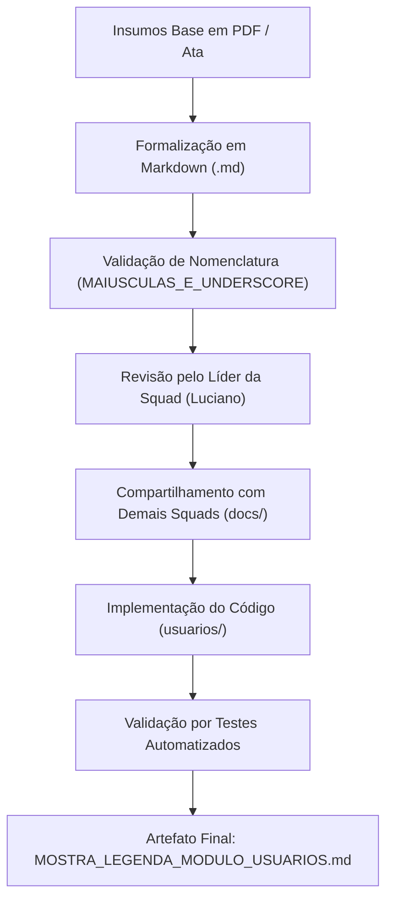

# Catálogo de Artefatos de Documentação — Módulo de Usuários, Autenticação e Permissões

| Metadado | Detalhe |
|---|---|
| **Projeto** | SGIE — Sistema de Gestão de Inscrições e Eventos Universitários |
| **Módulo** | Usuários, Autenticação e Permissões (Squad 1) |
| **Diretório Alvo** | `docs/` |
| **Padrão de Nomenclatura** | Letras maiúsculas e underscore (`[A-Z0-9_]+\.md`) |
| **Data de Elaboração** | 21 de setembro de 2026 |
| **Versão** | 1.1.0 |
| **Status** | Artefatos Elaborados e Homologados |

---

## 1. Visão Geral e Propósito

Este documento cataloga, padroniza e referencia todos os artefatos técnicos em formato Markdown (`.md`) que compõem o diretório `docs/` do projeto, fornecendo a base completa para a implementação, testes, segurança e integração do **Módulo de Usuários, Autenticação e Permissões (Squad 1)**.

Em conformidade com a deliberação da Reunião de Líderes do dia 20 de setembro de 2026 (registrada em `docs/docs_base/ATA_REUNIAO.md`), toda a modelagem produzida foi formalizada em Markdown no repositório antes do início do desenvolvimento do MVP, garantindo rastreabilidade, independência entre squads e contratos claros de integração.

---

## 2. Regras de Padronização e Conformidade

1. **Formato Exclusivo**: Todos os documentos possuem a extensão `.md` (Markdown padrão GitHub / GFM).
2. **Nomenclatura Canônica**: Todas as letras em maiúsculas, com palavras separadas unicamente por sublinhado (underscore `_`), sem espaços ou caracteres especiais (ex.: `REQUISITOS_FUNCIONAIS_E_REGRAS_DE_NEGOCIO.md`).
3. **Diagramas Vivos**: Modelagens gráficas expressas em blocos nativos de código Mermaid (` ```mermaid `), viabilizando versionamento e renderização direta sem dependência de binários externos.
4. **Rastreabilidade Bidirecional**: Cada artefato faz referência explícita aos Requisitos Funcionais (`RFxx`) e Regras de Negócio (`RNxx`) aos quais está associado.

---

## 3. Quadro Geral dos Artefatos do Módulo

| # | Nome do Artefato (`.md`) | Categoria | Status | Fonte de Origem / Insumo |
|:---:|---|---|:---:|---|
| **01** | [`LISTA_ARTEFATOS.md`](file:///c:/Users/jegue/Desktop/SGIE/docs/LISTA_ARTEFATOS.md) | Governança | Concluído | Diretrizes gerais do projeto e escopo do módulo |
| **02** | [`REQUISITOS_FUNCIONAIS_E_REGRAS_DE_NEGOCIO.md`](file:///c:/Users/jegue/Desktop/SGIE/docs/REQUISITOS_FUNCIONAIS_E_REGRAS_DE_NEGOCIO.md) | Requisitos | Concluído | `requisitos_funcionais_regras_negocios_md.pdf` |
| **03** | [`DIAGRAMA_DE_CASOS_DE_USO.md`](file:///c:/Users/jegue/Desktop/SGIE/docs/DIAGRAMA_DE_CASOS_DE_USO.md) | Modelagem | Concluído | `diagrama_casos_uso.pdf` |
| **04** | [`MODELAGEM_DE_DADOS_E_CLASSES.md`](file:///c:/Users/jegue/Desktop/SGIE/docs/MODELAGEM_DE_DADOS_E_CLASSES.md) | Modelagem | Concluído | `diagrama_conceitual_classes.pdf` |
| **05** | [`DICIONARIO_DE_DADOS.md`](file:///c:/Users/jegue/Desktop/SGIE/docs/DICIONARIO_DE_DADOS.md) | Banco de Dados | Concluído | Diagrama conceitual e `usuarios/models.py` |
| **06** | [`DIAGRAMAS_DE_SEQUENCIA.md`](file:///c:/Users/jegue/Desktop/SGIE/docs/DIAGRAMAS_DE_SEQUENCIA.md) | Comportamento | Concluído | `diagrama_sequencia_cadastro_login.pdf` |
| **07** | [`ARQUITETURA_DO_MODULO.md`](file:///c:/Users/jegue/Desktop/SGIE/docs/ARQUITETURA_DO_MODULO.md) | Arquitetura | Concluído | `molde_modulo_usuarios.zip` e `ATA_REUNIAO.md` |
| **08** | [`AUTENTICACAO_E_PERMISSOES.md`](file:///c:/Users/jegue/Desktop/SGIE/docs/AUTENTICACAO_E_PERMISSOES.md) | Segurança | Concluído | Regras RN01-RN05 e requisitos RF02-RF04 |
| **09** | [`CONTRATO_DE_INTEGRACAO.md`](file:///c:/Users/jegue/Desktop/SGIE/docs/CONTRATO_DE_INTEGRACAO.md) | Integração | Concluído | `relatorio_de_atividades_squad1.pdf` (Seção P&R) |
| **10** | [`ESPECIFICACAO_DE_TELAS_E_FORMULARIOS.md`](file:///c:/Users/jegue/Desktop/SGIE/docs/ESPECIFICACAO_DE_TELAS_E_FORMULARIOS.md) | Interface/Views | Concluído | Templates do molde (`cadastro.html`, `login.html`, etc.) |
| **11** | [`PLANO_DE_TESTES_E_VALIDACAO.md`](file:///c:/Users/jegue/Desktop/SGIE/docs/PLANO_DE_TESTES_E_VALIDACAO.md) | Qualidade | Concluído | Requisitos funcionais, regras e cenários de erro |
| **12** | [`GUIA_DE_INSTALACAO_E_CONFIGURACAO.md`](file:///c:/Users/jegue/Desktop/SGIE/docs/GUIA_DE_INSTALACAO_E_CONFIGURACAO.md) | Operacional | Concluído | `manage.py`, `core/settings.py` e ambiente local |
| **13** | [`RELATORIO_DE_ATIVIDADES_E_MARCOS_SQUAD_1.md`](file:///c:/Users/jegue/Desktop/SGIE/docs/RELATORIO_DE_ATIVIDADES_E_MARCOS_SQUAD_1.md) | Gestão | Concluído | `relatorio_de_atividades_squad1.pdf` e marcos |
| **14** | `MOSTRA_LEGENDA_MODULO_USUARIOS.md` | Entrega/Código | Pós-Código | Código-fonte implementado em `usuarios/` |

---

## 4. Detalhamento Especificativo de Cada Artefato

### 01. [`LISTA_ARTEFATOS.md`](file:///c:/Users/jegue/Desktop/SGIE/docs/LISTA_ARTEFATOS.md)
- **Função**: Índice consolidado e catálogo oficial de governança dos documentos da pasta `docs/`.
- **Conteúdo**: Inventário completo, regras de nomenclatura, status de elaboração e matriz de rastreabilidade.

---

### 02. [`REQUISITOS_FUNCIONAIS_E_REGRAS_DE_NEGOCIO.md`](file:///c:/Users/jegue/Desktop/SGIE/docs/REQUISITOS_FUNCIONAIS_E_REGRAS_DE_NEGOCIO.md)
- **Função**: Formalização descritiva de todos os requisitos funcionais e regras de negócio do módulo.
- **Insumo Principal**: `requisitos_funcionais_regras_negocios_md.pdf`.
- **Conteúdo**:
  - `RF01 – Cadastrar Usuário` (Nome completo, E-mail, CPF, Data de Nascimento, Telefone).
  - `RF02 – Autenticar Usuário (Login)` (E-mail/CPF + senha e integração Google).
  - `RF03 – Recuperar Acesso` (Código de verificação de 6 dígitos via e-mail).
  - `RF04 – Atualizar Perfil de Organizador` (Foto, banner e mini-biografia).
  - `RF05 – Criar e Gerenciar Eventos` (Controle de acesso para organizadores).
  - `RF06 – Inscrição em Eventos` (Seleção de papéis).
  - `RF07 – Submeter Trabalhos e Documentos` (Apenas Autores).
  - `RF08 – Avaliar Trabalhos Submetidos` (Apenas Avaliadores).
  - `RN01` a `RN06` detalhadas (Unicidade, Herança, Multiplicidade por evento, Promoção a organizador, Restrição por papel, Disponibilidade de dados).

---

### 03. [`DIAGRAMA_DE_CASOS_DE_USO.md`](file:///c:/Users/jegue/Desktop/SGIE/docs/DIAGRAMA_DE_CASOS_DE_USO.md)
- **Função**: Modelagem comportamental dos casos de uso e atores do sistema.
- **Insumo Principal**: `diagrama_casos_uso.pdf`.
- **Conteúdo**: Diagrama Mermaid com atores (*Usuário Não Autenticado*, *Participante*, *Autor*, *Avaliador*, *ADM / Organizador*), especificações UC01 a UC08, inclusões (`<<include>>`), extensões (`<<extend>>`) e fluxos principais/exceção.

---

### 04. [`MODELAGEM_DE_DADOS_E_CLASSES.md`](file:///c:/Users/jegue/Desktop/SGIE/docs/MODELAGEM_DE_DADOS_E_CLASSES.md)
- **Função**: Modelagem conceitual e lógica das entidades do domínio.
- **Insumo Principal**: `diagrama_conceitual_classes.pdf`.
- **Conteúdo**: Diagrama de classes Mermaid (`Usuario`, `CodigoRecuperacao`, `PerfilOrganizador`, enumeração `Papel`, integrações com `Evento` e `Inscricao`), atributos, métodos e regras de cardinalidade.

---

### 05. [`DICIONARIO_DE_DADOS.md`](file:///c:/Users/jegue/Desktop/SGIE/docs/DICIONARIO_DE_DADOS.md)
- **Função**: Especificação técnica das tabelas relacionais do módulo.
- **Insumo Principal**: Diagrama conceitual e mapeamento Django ORM.
- **Conteúdo**: Tabelas `usuarios_usuario`, `usuarios_perfilorganizador`, `usuarios_codigorecuperacao` e `usuarios_papelcontextual`, com tipos de dados, restrições, índices e integridade referencial.

---

### 06. [`DIAGRAMAS_DE_SEQUENCIA.md`](file:///c:/Users/jegue/Desktop/SGIE/docs/DIAGRAMAS_DE_SEQUENCIA.md)
- **Função**: Ordem cronológica de mensagens entre Ator, Views, Services e Banco de Dados.
- **Insumo Principal**: `diagrama_sequencia_cadastro_login.pdf`.
- **Conteúdo**: Diagramas Mermaid cobrindo Cadastro de Usuário, Login Tradicional (E-mail/CPF), Recuperação de Senha por Código e Atualização de Perfil de Organizador.

---

### 07. [`ARQUITETURA_DO_MODULO.md`](file:///c:/Users/jegue/Desktop/SGIE/docs/ARQUITETURA_DO_MODULO.md)
- **Função**: Topologia arquitetural e divisão de responsabilidades no padrão Django MTV + Service Layer.
- **Insumo Principal**: `molde_modulo_usuarios.zip` e `ATA_REUNIAO.md`.
- **Conteúdo**: Estrutura de arquivos do app `usuarios/`, responsabilidade de cada camada (`models`, `forms`, `services`, `views`, `permissions`, `templates`), isolamento de namespaces e integração com `core/settings.py`.

---

### 08. [`AUTENTICACAO_E_PERMISSOES.md`](file:///c:/Users/jegue/Desktop/SGIE/docs/AUTENTICACAO_E_PERMISSOES.md)
- **Função**: Especificação de segurança, mecanismos de login e RBAC contextual.
- **Insumo Principal**: Regras RN01-RN05 e Requisitos RF02-RF04.
- **Conteúdo**: Backend `EmailOrCPFBackend`, autenticação Google OAuth2, geração segura e expiração de códigos temporários, matriz de acesso e decorators (`@login_required`, `@organizador_required`, `@role_required`).

---

### 09. [`CONTRATO_DE_INTEGRACAO.md`](file:///c:/Users/jegue/Desktop/SGIE/docs/CONTRATO_DE_INTEGRACAO.md)
- **Função**: Fronteiras e contratos de interface com Squad 2 (Eventos), Squad 3 (Inscrições), Submissões e Financeiro.
- **Insumo Principal**: Seção P&R de `relatorio_de_atividades_squad1.pdf`.
- **Conteúdo**: Respostas fundamentais de alinhamento, dados compartilhados (`RN06`), serviços públicos da classe `UsuarioService` e diretrizes de conformidade com a LGPD.

---

### 10. [`ESPECIFICACAO_DE_TELAS_E_FORMULARIOS.md`](file:///c:/Users/jegue/Desktop/SGIE/docs/ESPECIFICACAO_DE_TELAS_E_FORMULARIOS.md)
- **Função**: Detalhamento funcional das telas da Fase 1 em HTML puro sem estilização CSS.
- **Insumo Principal**: Templates do molde e Ata de Reunião (Item 2.6).
- **Conteúdo**: Especificação de `cadastro.html`, `login.html`, `recuperar_senha.html` e `perfil.html`, com inputs, nomes de campos, proteção CSRF e mensagens flash.

---

### 11. [`PLANO_DE_TESTES_E_VALIDACAO.md`](file:///c:/Users/jegue/Desktop/SGIE/docs/PLANO_DE_TESTES_E_VALIDACAO.md)
- **Função**: Matriz de garantia da qualidade e testes automatizados.
- **Insumo Principal**: Requisitos e Regras do módulo.
- **Conteúdo**: Casos de teste para modelos, formulários, serviços e views/rotas HTTP, comandos de execução e metas de integração com CI.

---

### 12. [`GUIA_DE_INSTALACAO_E_CONFIGURACAO.md`](file:///c:/Users/jegue/Desktop/SGIE/docs/GUIA_DE_INSTALACAO_E_CONFIGURACAO.md)
- **Função**: Manual de configuração e execução local para desenvolvedores.
- **Insumo Principal**: Ambiente do projeto (`requirements.txt`, `manage.py`, `.env`).
- **Conteúdo**: Pré-requisitos, ativação de ambiente virtual, migrações, criação de superusuário, execução de testes e comandos do servidor local.

---

### 13. [`RELATORIO_DE_ATIVIDADES_E_MARCOS_SQUAD_1.md`](file:///c:/Users/jegue/Desktop/SGIE/docs/RELATORIO_DE_ATIVIDADES_E_MARCOS_SQUAD_1.md)
- **Função**: Histórico de governança, divisão da equipe e marcos cronológicos do Squad 1.
- **Insumo Principal**: `relatorio_de_atividades_squad1.pdf` e anotações de marcos.
- **Conteúdo**: Registro de tarefas de Gabriele, Letícia Farias, Letícia Vitorino e Luciano, marcos atingidos e cronograma detalhado até o MVP.

---

### 14. `MOSTRA_LEGENDA_MODULO_USUARIOS.md`
- **Função**: Amostra e legenda sequencial de todos os termos técnicos e trechos de código.
- **Status**: Previsto para a conclusão da implementação do código-fonte em `usuarios/`.

---

## 5. Matriz de Rastreabilidade (Requisitos x Artefatos)

| Requisito / Regra | Descrição Sumária | Artefatos de Especificação e Cobertura |
|:---:|---|---|
| **RF01** | Cadastrar Usuário | [`REQUISITOS_FUNCIONAIS_E_REGRAS_DE_NEGOCIO.md`](file:///c:/Users/jegue/Desktop/SGIE/docs/REQUISITOS_FUNCIONAIS_E_REGRAS_DE_NEGOCIO.md), [`MODELAGEM_DE_DADOS_E_CLASSES.md`](file:///c:/Users/jegue/Desktop/SGIE/docs/MODELAGEM_DE_DADOS_E_CLASSES.md), [`DIAGRAMAS_DE_SEQUENCIA.md`](file:///c:/Users/jegue/Desktop/SGIE/docs/DIAGRAMAS_DE_SEQUENCIA.md), [`ESPECIFICACAO_DE_TELAS_E_FORMULARIOS.md`](file:///c:/Users/jegue/Desktop/SGIE/docs/ESPECIFICACAO_DE_TELAS_E_FORMULARIOS.md), [`PLANO_DE_TESTES_E_VALIDACAO.md`](file:///c:/Users/jegue/Desktop/SGIE/docs/PLANO_DE_TESTES_E_VALIDACAO.md) |
| **RF02** | Autenticar Usuário (Login) | [`REQUISITOS_FUNCIONAIS_E_REGRAS_DE_NEGOCIO.md`](file:///c:/Users/jegue/Desktop/SGIE/docs/REQUISITOS_FUNCIONAIS_E_REGRAS_DE_NEGOCIO.md), [`AUTENTICACAO_E_PERMISSOES.md`](file:///c:/Users/jegue/Desktop/SGIE/docs/AUTENTICACAO_E_PERMISSOES.md), [`DIAGRAMAS_DE_SEQUENCIA.md`](file:///c:/Users/jegue/Desktop/SGIE/docs/DIAGRAMAS_DE_SEQUENCIA.md), [`ESPECIFICACAO_DE_TELAS_E_FORMULARIOS.md`](file:///c:/Users/jegue/Desktop/SGIE/docs/ESPECIFICACAO_DE_TELAS_E_FORMULARIOS.md) |
| **RF03** | Recuperar Acesso | [`REQUISITOS_FUNCIONAIS_E_REGRAS_DE_NEGOCIO.md`](file:///c:/Users/jegue/Desktop/SGIE/docs/REQUISITOS_FUNCIONAIS_E_REGRAS_DE_NEGOCIO.md), [`AUTENTICACAO_E_PERMISSOES.md`](file:///c:/Users/jegue/Desktop/SGIE/docs/AUTENTICACAO_E_PERMISSOES.md), [`MODELAGEM_DE_DADOS_E_CLASSES.md`](file:///c:/Users/jegue/Desktop/SGIE/docs/MODELAGEM_DE_DADOS_E_CLASSES.md), [`ESPECIFICACAO_DE_TELAS_E_FORMULARIOS.md`](file:///c:/Users/jegue/Desktop/SGIE/docs/ESPECIFICACAO_DE_TELAS_E_FORMULARIOS.md) |
| **RF04** | Atualizar Perfil de Organizador | [`REQUISITOS_FUNCIONAIS_E_REGRAS_DE_NEGOCIO.md`](file:///c:/Users/jegue/Desktop/SGIE/docs/REQUISITOS_FUNCIONAIS_E_REGRAS_DE_NEGOCIO.md), [`MODELAGEM_DE_DADOS_E_CLASSES.md`](file:///c:/Users/jegue/Desktop/SGIE/docs/MODELAGEM_DE_DADOS_E_CLASSES.md), [`ESPECIFICACAO_DE_TELAS_E_FORMULARIOS.md`](file:///c:/Users/jegue/Desktop/SGIE/docs/ESPECIFICACAO_DE_TELAS_E_FORMULARIOS.md) |
| **RF05** | Criar e Gerenciar Eventos (Permissões) | [`REQUISITOS_FUNCIONAIS_E_REGRAS_DE_NEGOCIO.md`](file:///c:/Users/jegue/Desktop/SGIE/docs/REQUISITOS_FUNCIONAIS_E_REGRAS_DE_NEGOCIO.md), [`AUTENTICACAO_E_PERMISSOES.md`](file:///c:/Users/jegue/Desktop/SGIE/docs/AUTENTICACAO_E_PERMISSOES.md), [`CONTRATO_DE_INTEGRACAO.md`](file:///c:/Users/jegue/Desktop/SGIE/docs/CONTRATO_DE_INTEGRACAO.md) |
| **RF06** | Inscrição com Seleção de Papéis | [`REQUISITOS_FUNCIONAIS_E_REGRAS_DE_NEGOCIO.md`](file:///c:/Users/jegue/Desktop/SGIE/docs/REQUISITOS_FUNCIONAIS_E_REGRAS_DE_NEGOCIO.md), [`AUTENTICACAO_E_PERMISSOES.md`](file:///c:/Users/jegue/Desktop/SGIE/docs/AUTENTICACAO_E_PERMISSOES.md), [`CONTRATO_DE_INTEGRACAO.md`](file:///c:/Users/jegue/Desktop/SGIE/docs/CONTRATO_DE_INTEGRACAO.md) |
| **RF07** | Submissão de Trabalhos (Autor) | [`REQUISITOS_FUNCIONAIS_E_REGRAS_DE_NEGOCIO.md`](file:///c:/Users/jegue/Desktop/SGIE/docs/REQUISITOS_FUNCIONAIS_E_REGRAS_DE_NEGOCIO.md), [`AUTENTICACAO_E_PERMISSOES.md`](file:///c:/Users/jegue/Desktop/SGIE/docs/AUTENTICACAO_E_PERMISSOES.md), [`CONTRATO_DE_INTEGRACAO.md`](file:///c:/Users/jegue/Desktop/SGIE/docs/CONTRATO_DE_INTEGRACAO.md) |
| **RF08** | Avaliação de Trabalhos (Avaliador) | [`REQUISITOS_FUNCIONAIS_E_REGRAS_DE_NEGOCIO.md`](file:///c:/Users/jegue/Desktop/SGIE/docs/REQUISITOS_FUNCIONAIS_E_REGRAS_DE_NEGOCIO.md), [`AUTENTICACAO_E_PERMISSOES.md`](file:///c:/Users/jegue/Desktop/SGIE/docs/AUTENTICACAO_E_PERMISSOES.md), [`CONTRATO_DE_INTEGRACAO.md`](file:///c:/Users/jegue/Desktop/SGIE/docs/CONTRATO_DE_INTEGRACAO.md) |
| **RN01** | Unicidade de Cadastro (CPF e E-mail) | [`REQUISITOS_FUNCIONAIS_E_REGRAS_DE_NEGOCIO.md`](file:///c:/Users/jegue/Desktop/SGIE/docs/REQUISITOS_FUNCIONAIS_E_REGRAS_DE_NEGOCIO.md), [`DICIONARIO_DE_DADOS.md`](file:///c:/Users/jegue/Desktop/SGIE/docs/DICIONARIO_DE_DADOS.md), [`MODELAGEM_DE_DADOS_E_CLASSES.md`](file:///c:/Users/jegue/Desktop/SGIE/docs/MODELAGEM_DE_DADOS_E_CLASSES.md), [`PLANO_DE_TESTES_E_VALIDACAO.md`](file:///c:/Users/jegue/Desktop/SGIE/docs/PLANO_DE_TESTES_E_VALIDACAO.md) |
| **RN02** | Herança de Papéis Especiais | [`REQUISITOS_FUNCIONAIS_E_REGRAS_DE_NEGOCIO.md`](file:///c:/Users/jegue/Desktop/SGIE/docs/REQUISITOS_FUNCIONAIS_E_REGRAS_DE_NEGOCIO.md), [`AUTENTICACAO_E_PERMISSOES.md`](file:///c:/Users/jegue/Desktop/SGIE/docs/AUTENTICACAO_E_PERMISSOES.md), [`MODELAGEM_DE_DADOS_E_CLASSES.md`](file:///c:/Users/jegue/Desktop/SGIE/docs/MODELAGEM_DE_DADOS_E_CLASSES.md) |
| **RN03** | Multiplicidade de Papéis por Evento | [`REQUISITOS_FUNCIONAIS_E_REGRAS_DE_NEGOCIO.md`](file:///c:/Users/jegue/Desktop/SGIE/docs/REQUISITOS_FUNCIONAIS_E_REGRAS_DE_NEGOCIO.md), [`AUTENTICACAO_E_PERMISSOES.md`](file:///c:/Users/jegue/Desktop/SGIE/docs/AUTENTICACAO_E_PERMISSOES.md), [`CONTRATO_DE_INTEGRACAO.md`](file:///c:/Users/jegue/Desktop/SGIE/docs/CONTRATO_DE_INTEGRACAO.md) |
| **RN04** | Promoção a Organizador / ADM | [`REQUISITOS_FUNCIONAIS_E_REGRAS_DE_NEGOCIO.md`](file:///c:/Users/jegue/Desktop/SGIE/docs/REQUISITOS_FUNCIONAIS_E_REGRAS_DE_NEGOCIO.md), [`MODELAGEM_DE_DADOS_E_CLASSES.md`](file:///c:/Users/jegue/Desktop/SGIE/docs/MODELAGEM_DE_DADOS_E_CLASSES.md), [`ESPECIFICACAO_DE_TELAS_E_FORMULARIOS.md`](file:///c:/Users/jegue/Desktop/SGIE/docs/ESPECIFICACAO_DE_TELAS_E_FORMULARIOS.md) |
| **RN05** | Restrição de Submissão e Avaliação | [`REQUISITOS_FUNCIONAIS_E_REGRAS_DE_NEGOCIO.md`](file:///c:/Users/jegue/Desktop/SGIE/docs/REQUISITOS_FUNCIONAIS_E_REGRAS_DE_NEGOCIO.md), [`AUTENTICACAO_E_PERMISSOES.md`](file:///c:/Users/jegue/Desktop/SGIE/docs/AUTENTICACAO_E_PERMISSOES.md), [`CONTRATO_DE_INTEGRACAO.md`](file:///c:/Users/jegue/Desktop/SGIE/docs/CONTRATO_DE_INTEGRACAO.md) |
| **RN06** | Disponibilidade de Dados de Usuário | [`REQUISITOS_FUNCIONAIS_E_REGRAS_DE_NEGOCIO.md`](file:///c:/Users/jegue/Desktop/SGIE/docs/REQUISITOS_FUNCIONAIS_E_REGRAS_DE_NEGOCIO.md), [`CONTRATO_DE_INTEGRACAO.md`](file:///c:/Users/jegue/Desktop/SGIE/docs/CONTRATO_DE_INTEGRACAO.md), [`ARQUITETURA_DO_MODULO.md`](file:///c:/Users/jegue/Desktop/SGIE/docs/ARQUITETURA_DO_MODULO.md) |

---

## 6. Fluxo de Elaboração e Ciclo de Vida dos Documentos


