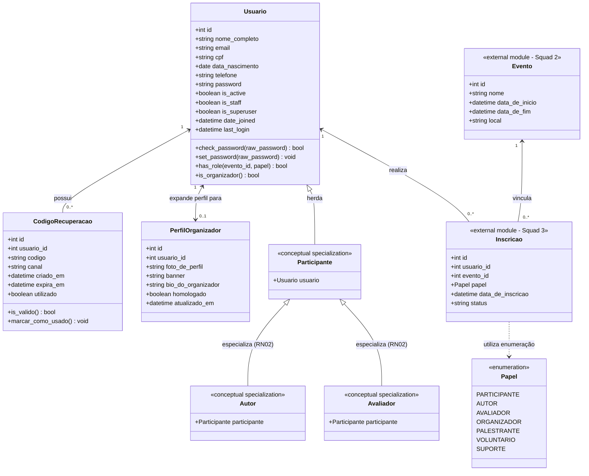

# Modelagem de Dados e Diagrama de Classes

| Metadado | Detalhe |
|---|---|
| **Projeto** | SGIE — Sistema de Gestão de Inscrições e Eventos Universitários |
| **Módulo** | Usuários, Autenticação e Permissões (Squad 1) |
| **Responsável pela Modelagem** | Letícia Farias |
| **Líder da Squad** | Luciano de Souza |
| **Data de Criação** | 21 de setembro de 2026 |
| **Versão** | 1.0.0 |
| **Status** | Homologado para Implementação |

---

## 1. Introdução

Este documento formaliza a modelagem estrutural das entidades de dados e do diagrama de classes do **Módulo de Usuários, Autenticação e Permissões**, baseando-se no rascunho conceitual documentado em `diagrama_conceitual_classes.pdf`.

A modelagem foi concebida para atender rigorosamente às regras de negócio de unicidade (`RN01`), herança conceitual de papéis especiais (`RN02`), multiplicidade contextual por evento (`RN03`) e expansão de perfil para organizadores (`RN04`).

---

## 2. Diagrama de Classes (Mermaid)



---

## 3. Detalhamento das Entidades e Atributos

### 3.1 Entidade `Usuario` (Custom User Model)
Centraliza a identidade do usuário no ecossistema Django, substituindo o modelo nativo `auth.User` para suportar `CPF` único e identificação via e-mail.
- `id` (`BigAutoField`): Identificador único auto-incremental (chave primária).
- `nome_completo` (`CharField`, max_length=150): Nome e sobrenome do usuário.
- `email` (`EmailField`, unique=True): Correio eletrônico único, normalizado em minúsculas (`RN01`).
- `cpf` (`CharField`, max_length=14, unique=True): Documento nacional de 11 dígitos, armazenado desmascarado ou padronizado (`RN01`).
- `data_nascimento` (`DateField`): Data de nascimento para comprovação de maioridade e segmentação de público.
- `telefone` (`CharField`, max_length=20): Contato telefônico com DDD.
- `password` (`CharField`, max_length=128): Hash criptográfico da senha (padrão PBKDF2 do Django).
- `is_active` (`BooleanField`, default=True): Flag indicando se a conta pode efetuar login.
- `is_staff` (`BooleanField`, default=False): Permite acesso ao Django Admin.
- `is_superuser` (`BooleanField`, default=False): Concede todas as permissões no sistema.
- `date_joined` (`DateTimeField`, auto_now_add=True): Timestamp de criação do registro.
- `last_login` (`DateTimeField`, null=True, blank=True): Registro do último acesso bem-sucedido.

---

### 3.2 Entidade `CodigoRecuperacao`
Controla os códigos temporários e canais de recuperação de acesso (`RF03`).
- `id` (`BigAutoField`): Chave primária.
- `usuario` (`ForeignKey` para `Usuario`, `on_delete=CASCADE`): Referência ao usuário que solicitou redefinição.
- `codigo` (`CharField`, max_length=6): Código numérico gerado aleatoriamente (ex.: `849201`).
- `canal` (`CharField`, max_length=20, default='EMAIL'): Canal de entrega (por padrão e-mail institucional ou cadastrado).
- `criado_em` (`DateTimeField`, auto_now_add=True): Data e hora de emissão do código.
- `expira_em` (`DateTimeField`): Data e hora de expiração (15 minutos após a criação).
- `utilizado` (`BooleanField`, default=False): Sinalizador de consumo único.

---

### 3.3 Entidade `PerfilOrganizador`
Armazena os metadados visuais e biográficos requeridos para promoção do usuário ao papel de organizador/administrador de eventos (`RF04`, `RN04`).
- `id` (`BigAutoField`): Chave primária.
- `usuario` (`OneToOneField` para `Usuario`, `on_delete=CASCADE`): Relação unívoca com a conta de usuário.
- `foto_de_perfil` (`ImageField`, upload_to='organizadores/fotos/'): Foto de exibição pública.
- `banner` (`ImageField`, upload_to='organizadores/banners/'): Imagem panorâmica de cabeçalho.
- `bio_do_organizador` (`TextField`, max_length=1000): Mini-biografia e descrição de autoridade institucional.
- `homologado` (`BooleanField`, default=False): Indica se a solicitação foi aprovada pela coordenação geral.
- `atualizado_em` (`DateTimeField`, auto_now=True): Timestamp da última edição.

---

### 3.4 Enumeração `Papel`
Especifica todos os papéis aceitos pelo sistema para participação contextual em eventos:
1. `PARTICIPANTE`: Ouvinte ou congressista geral.
2. `AUTOR`: Usuário apto a submeter artigos e trabalhos científicos (`RN05`).
3. `AVALIADOR`: Membro de comitê científico para emitir notas (`RN05`).
4. `ORGANIZADOR`: Membro da comissão organizadora executiva.
5. `PALESTRANTE`: Convidado ou ministrante de palestra/minicurso.
6. `VOLUNTARIO`: Equipe de suporte operacional e credenciamento.
7. `SUPORTE`: Apoio técnico de áudio, vídeo, informática e logística.

---

## 4. Mapeamento Lógico e Implementação no Django

1. **Configuração de Autenticação**:
   O modelo `Usuario` é registrado em `core/settings.py` como modelo principal através de:
   ```python
   AUTH_USER_MODEL = 'usuarios.Usuario'
   ```
2. **Gerenciador Customizado (`UsuarioManager`)**:
   Implementa `create_user` e `create_superuser` validando a obrigatoriedade de CPF e e-mail.
3. **Multiplicidade de Papéis**:
   A relação conceitual de papéis por evento é materializada através da tabela de `Inscricao` (ou `PapelUsuarioEvento`), evitando colunas estáticas na tabela `Usuario` e respeitando estritamente a regra `RN03`.
