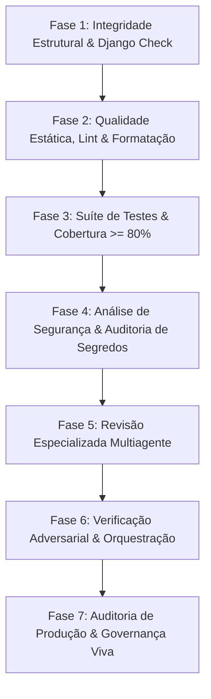

# Plano de Execução do Harness para Revisão do Projeto SGIE

Este documento estabelece o roteiro padronizado e a lista exaustiva de verificações, comandos, workflows e subagentes do **Harness de Engenharia** (localizado em [`.agents/`](file:///c:/Users/jegue/Desktop/SGIE/.agents)) que devem ser executados para a revisão completa do projeto **SGIE (Sistema de Gestão Integrada de Eventos)**.

---

## 1. Visão Geral da Arquitetura do Harness

O Harness do SGIE baseia-se no framework ECC (*Everything Claude Code / Antigravity Harness*), estruturado em quatro camadas operacionais coordenadas:

```
.agents/
├── rules/        # Diretrizes e contratos normativos de código, segurança e testes
├── workflows/    # Pipelines automatizados e comandos determinísticos de revisão
├── agents/       # Subagentes especializados por domínio técnico (Django, Python, DB, Segurança)
└── skills/       # Procedimentos estruturados de verificação contínua e prontidão
```

### Princípios Norteadores da Revisão
1. **Contrato *Fail-Closed***: Em caso de falha de ferramentas, timeout ou revisão incompleta, o resultado padrão é **rejeição/bloqueio**. Nunca emitir aprovação tácita diante de incertezas.
2. **Filtragem por Evidência Concreta (> 80% de confiança)**: Achados classificados como `CRITICAL` ou `HIGH` exigem arquivo, linha exata, cenário de reprodução e demonstração de falha dos guardrails existentes.
3. **Auditabilidade e Reprodutibilidade**: Todos os comandos devem produzir saídas determinísticas e rastreáveis no histórico do repositório.

---

## 2. Pipeline Sequencial de Execução da Revisão

A execução do Harness deve seguir estritamente o fluxo sequencial dividido em **7 fases** fundamentais:



---

### Fase 1: Integridade Estrutural e Sanidade do Framework (Django Check)

Antes de qualquer análise de código, valida-se se o projeto inicializa sem erros estruturais e se há sincronismo entre modelos de banco de dados e migrações.

| Verificação | Comando do Harness / CLI | Objetivo / Critério de Aceite | Agente / Regra |
| :--- | :--- | :--- | :--- |
| **System Check** | `python manage.py check` | Garantir que a configuração do Django, apps e URLs estejam íntegras (0 erros). | [django-reviewer](file:///c:/Users/jegue/Desktop/SGIE/.agents/agents/django-reviewer.md) |
| **Drift de Migrações** | `python manage.py makemigrations --check` | Garantir que nenhum modelo Python foi alterado sem a respectiva migração gerada. Retorno `code 0`. | [django-reviewer](file:///c:/Users/jegue/Desktop/SGIE/.agents/agents/django-reviewer.md) |
| **Deploy Sanity Check** | `python manage.py check --deploy` | Identificar flags de segurança ausentes em ambiente de implantação (cookies, SSL, etc.). | [production-audit](file:///c:/Users/jegue/Desktop/SGIE/.agents/skills/production-audit/SKILL.md) |

> [!WARNING]
> **Ponto Crítico Identificado no Projeto:** A execução de `python manage.py makemigrations --check` detecta alterações pendentes no app `usuarios` (`bio_do_organizador`). Nenhuma revisão de código deve ser dada como aprovada enquanto houver deriva não versionada no esquema de banco.

---

### Fase 2: Conformidade Estática, Formatação e Tipagem (Quality Gate)

Execução do gate de formatação e análise estática rigorosa conforme configurado no [`ruff.toml`](file:///c:/Users/jegue/Desktop/SGIE/ruff.toml) e nas regras de codificação Python.

| Verificação | Comando do Harness / CLI | Workflow / Skill Associado | Regra / Critério de Aceite |
| :--- | :--- | :--- | :--- |
| **Linter Completo** | `python -m ruff check .` | [`/quality-gate`](file:///c:/Users/jegue/Desktop/SGIE/.agents/workflows/quality-gate.md) | Validação de regras ativas: `I` (Imports), `F` (Pyflakes), `E`/`W` (pycodestyle), `PL` (Pylint), `PT` (Pytest), `DJ` (Django). Zero avisos ou erros. |
| **Formatação de Código** | `python -m ruff format --check .` | [`/quality-gate`](file:///c:/Users/jegue/Desktop/SGIE/.agents/workflows/quality-gate.md) | Conformidade de estilo (`single quotes`, line-length). Correção automática via `python -m ruff format .` se necessário. |
| **Checagem de Tipagem** | `mypy . --ignore-missing-imports` ou `pyright .` | [`verification-loop`](file:///c:/Users/jegue/Desktop/SGIE/.agents/skills/verification-loop/SKILL.md) | Verificação de assinaturas de funções e conformidade com [python-coding-style.md](file:///c:/Users/jegue/Desktop/SGIE/.agents/rules/python-coding-style.md). |

---

### Fase 3: Suíte de Testes Automatizados e Cobertura (Test Coverage)

Verificação da camada de testes automatizados, assegurando validade de comportamentos e o atingimento do limiar mínimo obrigatório de **80% de cobertura**.

| Verificação | Comando do Harness / CLI | Workflow / Skill Associado | Critério de Aceite |
| :--- | :--- | :--- | :--- |
| **Execução dos Testes** | `python manage.py test` | [`verification-loop`](file:///c:/Users/jegue/Desktop/SGIE/.agents/skills/verification-loop/SKILL.md) | 100% dos testes unitários e de integração devem passar sem erros (`OK`). |
| **Análise de Cobertura** | `pytest --cov=. --cov-report=term-missing` | [`/test-coverage`](file:///c:/Users/jegue/Desktop/SGIE/.agents/workflows/test-coverage.md) | Cobertura global $\ge 80\%$. Nenhuma função central de negócio com 0% de cobertura. |
| **Análise de Lacunas de Testes** | Subagente `pr-test-analyzer` | [`tdd-workflow`](file:///c:/Users/jegue/Desktop/SGIE/.agents/skills/tdd-workflow/SKILL.md) | Testes devem cobrir: *Happy Path*, limites de permissão (`401/403`), validação de formulários/serializers e casos de borda. |

---

### Fase 4: Análise de Segurança Estática e Gestão de Segredos (Security Scan)

Auditoria proativa para mitigação de vulnerabilidades OWASP Top 10, injeção de dados e exposição de credenciais.

| Verificação | Comando do Harness / CLI | Workflow / Skill | Alvos de Auditoria |
| :--- | :--- | :--- | :--- |
| **Scan de Vulnerabilidades Python** | `bandit -r core usuarios -ll` | [`/security-scan`](file:///c:/Users/jegue/Desktop/SGIE/.agents/workflows/security-scan.md) | Proibição de `eval/exec`, desserialização insegura (`pickle`), queries com concatenação de strings e uso de `mark_safe` sem sanitização. |
| **Auditoria de Dependências** | `pip-audit` ou `safety check` | [security-reviewer](file:///c:/Users/jegue/Desktop/SGIE/.agents/agents/security-reviewer.md) | Verificação de CVEs conhecidos nas versões fixadas em [`requirements.txt`](file:///c:/Users/jegue/Desktop/SGIE/requirements.txt). |
| **Varredura de Segredos** | Busca por padrões de chaves e senhas: `grep -rn "SECRET_KEY" core/` | [python-security.md](file:///c:/Users/jegue/Desktop/SGIE/.agents/rules/python-security.md) | Garantir que nenhuma credencial esteja hardcoded no código; uso obrigatório de `.env` via `python-dotenv`. |
| **Auditoria de Harness AgentShield** | `npx ecc-agentshield scan --path .` *(se disponível no ambiente)* | [`/security-scan`](file:///c:/Users/jegue/Desktop/SGIE/.agents/workflows/security-scan.md) | Verificação de permissões do harness, arquivos de configuração e superfícies expostas. |

---

### Fase 5: Revisão Especializada Multiagente (Especialistas de Domínio)

Convocação dos subagentes especializados do Harness para inspeção aprofundada dos arquivos alterados (`git diff --name-only HEAD`):

#### 1. [`django-reviewer`](file:///c:/Users/jegue/Desktop/SGIE/.agents/agents/django-reviewer.md) (Especialista em Django e DRF)
- [ ] **Consultas N+1**: Identificar iterações sobre relacionamentos FK/M2M e exigir `select_related` ou `prefetch_related`.
- [ ] **Atomicidade de Transações**: Mutações compostas no banco devem estar protegidas com `transaction.atomic()`.
- [ ] **Serializers DRF**: Proibir explicitamente `fields = '__all__'`. Exigir declaração pontual de campos ou `read_only_fields` em identificadores/timestamps.
- [ ] **Controle de Acesso em Views**: Garantir que toda View/ViewSet declare explicitamente `permission_classes`.
- [ ] **Existência e Contagem**: Substituir `len(qs)` por `qs.count()` e checagens `if qs:` por `qs.exists()`.
- [ ] **Separação de Camadas**: Regras de negócio complexas isoladas em `services.py`, não acopladas diretamente em views ou serializers.
- [ ] **Mutabilidade de Modelos**: Evitar `save()` global sem parâmetro `update_fields` em atualizações parciais.

#### 2. [`python-reviewer`](file:///c:/Users/jegue/Desktop/SGIE/.agents/agents/python-reviewer.md) (Especialista em Python Idiomático)
- [ ] **Anotações de Tipagem**: Presença de type hints em parâmetros e retornos de funções públicas.
- [ ] **Argumentos Padrão Mutáveis**: Proibição de listas ou dicionários como default (`def func(items=[]):` -> `def func(items=None):`).
- [ ] **Gerenciamento de Recursos**: Uso obrigatório de gerenciadores de contexto (`with open(...)`, conexões seguras).
- [ ] **Logging Estruturado**: Ausência de chamadas a `print()` em código de produção; uso exclusivo do módulo padrão `logging`.
- [ ] **Cláusulas Except Genéricas**: Proibição de blocos `except:` nus ou captura ampla de `Exception` sem relançamento contextualizado.

#### 3. [`database-reviewer`](file:///c:/Users/jegue/Desktop/SGIE/.agents/agents/database-reviewer.md) (Especialista em Banco de Dados & SQL)
- [ ] **Indexação de Chaves Estrangeiras**: Garantir índices adequados em campos com alto volume de consulta ou relacionamento.
- [ ] **Tamanho e Tipos de Dados**: Adequação de campos (`BigAutoField`, `CharField` com `max_length` justificado, `DateTimeField` com timezone).
- [ ] **Concorrência e Bloqueios**: Prevenção de deadlocks e verificação de consultas concorrentes usando `select_for_update()`.
- [ ] **Estratégia de Paginação**: Garantir paginação em listas para evitar exaustão de memória em consultas volumosas.

#### 4. [`code-reviewer`](file:///c:/Users/jegue/Desktop/SGIE/.agents/agents/code-reviewer.md) (Especialista em Qualidade Geral & Manutenibilidade)
- [ ] **Teto de Linhas por Arquivo**: Arquivos-fonte devem ter no máximo **800 linhas**.
- [ ] **Tamanho de Funções**: Funções devem manter foco e tamanho limitado a **50 linhas**.
- [ ] **Profundidade de Aninhamento**: Limite máximo de **4 níveis de indentação** (utilizar *early returns* e extração de helpers).
- [ ] **Código Morto e Comentários Debug**: Remoção de trechos comentados, logs esquecidos e declarações de debug.

#### 5. [`silent-failure-hunter`](file:///c:/Users/jegue/Desktop/SGIE/.agents/agents/silent-failure-hunter.md) (Caçador de Erros Silenciados)
- [ ] **Blocos Try/Except Vazios**: Detecção de `except Exception: pass` que ocultam falhas reais.
- [ ] **Fallbacks Inseguros**: Valores padrão que mascaram quebras em APIs upstream e dificultam diagnóstico.
- [ ] **Preservação de Stack Trace**: Exigência de `raise ... from err` ao encapsular exceções de domínio.

---

### Fase 6: Orquestração e Verificação Adversarial (Santa Method & Orch-Review)

Para evitar os vieses conhecidos de revisores de IA (falsos positivos especulativos ou aprovações condescendentes):

| Ação | Workflow / Mecanismo | Comportamento Obrigatório |
| :--- | :--- | :--- |
| **Pipeline Orquestrado de Revisão** | [`/orch-review`](file:///c:/Users/jegue/Desktop/SGIE/.agents/workflows/orch-review.md) | Execução paralela das dimensões de análise, deduplicação de evidências e consolidação de findings. |
| **Dupla Verificação Adversarial** | [`santa-method`](file:///c:/Users/jegue/Desktop/SGIE/.agents/skills/santa-method/SKILL.md) / [`/santa-loop`](file:///c:/Users/jegue/Desktop/SGIE/.agents/workflows/santa-loop.md) | Todo apontamento `CRITICAL` ou `HIGH` é submetido a um segundo avaliador adversarial para comprovar a falha antes de bloquear a entrega. |
| **Filtro de Falsos Positivos** | Seção *Common False Positives* de [`code-reviewer.md`](file:///c:/Users/jegue/Desktop/SGIE/.agents/agents/code-reviewer.md) | Descartar reclamações de estilo quando já atendidas pelo framework ou chamadas em camadas superiores. |

---

### Fase 7: Prontidão para Produção e Governança Documental

Última etapa antes da homologação final ou criação de Pull Request.

| Verificação | Ferramenta / Documento | Critério de Aceite |
| :--- | :--- | :--- |
| **Auditoria de Prontidão Operacional** | [`production-audit`](file:///c:/Users/jegue/Desktop/SGIE/.agents/skills/production-audit/SKILL.md) | Avaliação dos 5 eixos de risco: Segurança/Auth, Integridade de Dados, Operações, UX e Rollback. Scorecard $\ge 85/100$. |
| **Validação de Mensagens de Commit** | [`scripts/commits/validate-message.sh`](file:///c:/Users/jegue/Desktop/SGIE/scripts/commits/validate-message.sh) / [`docs/COMMITS.md`](file:///c:/Users/jegue/Desktop/SGIE/docs/COMMITS.md) | Garantir que todo commit adote a convenção *Conventional Commits v1.0.0* estabelecida no projeto. |
| **Governança de Documentação Viva** | [`living-docs-governance`](file:///c:/Users/jegue/Desktop/SGIE/.agents/skills/living-docs-governance/SKILL.md) | Sincronização entre contratos de API em código e documentação técnica em [`docs/modulo_squad1_usuarios_autenticacao_permissoes/`](file:///c:/Users/jegue/Desktop/SGIE/docs/modulo_squad1_usuarios_autenticacao_permissoes). |
| **Auditoria Determinística do Harness** | [`/harness-audit`](file:///c:/Users/jegue/Desktop/SGIE/.agents/workflows/harness-audit.md) | Avaliação da integridade de ferramentas, cobertura de hooks e eficiência de contexto no repositório. |

---

## 3. Matriz de Severidade e Decisão de Aprovação

Todos os apontamentos gerados durante a revisão devem ser enquadrados na matriz oficial do Harness (conforme [`common-code-review.md`](file:///c:/Users/jegue/Desktop/SGIE/.agents/rules/common-code-review.md)):

| Nível de Severidade | Definição e Impacto | Ação no Pipeline | Critério de Resolução |
| :--- | :--- | :--- | :--- |
| **CRITICAL** | Vulnerabilidade de segurança (injeção, segredo exposto), perda de dados, deriva de migrations sem arquivo ou desvio de integridade. | **BLOCK (Bloqueio Total)** | Correção imediata e mandatória antes de qualquer commit ou merge. Não é permitido prosseguir. |
| **HIGH** | Falha de linter, quebra de tipagem estática, N+1 query em loop, cobertura de testes $< 80\%$ ou quebra de testes. | **REQUEST CHANGES (Bloqueio)** | Deve ser corrigido antes da liberação da branch/PR. |
| **MEDIUM** | Desvios de boas práticas, ausência de docstrings públicas, complexidade próxima ao limite aceitável. | **WARNING / ADVISORY** | Recomendação forte de refatoração; permitido com aprovação explícita do time. |
| **LOW** | Nits de nomenclatura, sugestões cosméticas ou preferências estilísticas secundárias. | **NOTE (Informativo)** | Correção opcional a critério do desenvolvedor. |

### Critérios de Veredito Final
- **APPROVE**: Zero ocorrências `CRITICAL` e zero ocorrências `HIGH`. Todas as checagens automatizadas verdes.
- **REQUEST CHANGES**: Existência de pelo menos 1 ocorrência `HIGH` ou falha em suíte de testes / linter.
- **BLOCK**: Existência de pelo menos 1 ocorrência `CRITICAL` (ex.: segredos expostos, injeção SQL, migrações pendentes).

---

## 4. Checklist Consolidado de Execução Rápida

Utilize a lista de verificação abaixo durante cada ciclo de revisão no repositório SGIE:

- [ ] **1. Sanidade Django**: `python manage.py check` executado com sucesso (0 erros).
- [ ] **2. Checagem de Migrações**: `python manage.py makemigrations --check` retornou código 0 (sem migrações pendentes).
- [ ] **3. Linter e Estilo**: `python -m ruff check .` sem violações.
- [ ] **4. Formatação de Código**: `python -m ruff format --check .` sem desvios.
- [ ] **5. Tipagem Estática**: `mypy .` ou `pyright .` sem inconsistências de tipo em funções públicas.
- [ ] **6. Execução de Testes**: `python manage.py test` com 100% de aprovação.
- [ ] **7. Limiar de Cobertura**: Cobertura apurada atinge o mínimo de 80%.
- [ ] **8. Varredura de Segurança**: `bandit -r core usuarios` executado sem alertas críticos.
- [ ] **9. Gestão de Segredos**: Ausência de tokens, senhas ou `SECRET_KEY` hardcoded em arquivos versionados.
- [ ] **10. Revisão Django/DRF**: Endpoints com permissões explícitas, queries otimizadas (`select_related`/`prefetch_related`) e serializers sem `__all__`.
- [ ] **11. Revisão de Exceções**: Sem blocos `except: pass` e erros com rastreabilidade preservada (`from err`).
- [ ] **12. Manutenibilidade de Código**: Arquivos $\le 800$ linhas, funções $\le 50$ linhas, profundidade $\le 4$.
- [ ] **13. Formato de Commits**: Mensagens validadas pelo hook de Conventional Commits (`validate-message.sh`).
- [ ] **14. Documentação Sincronizada**: Contratos de integração e dicionário de dados em `docs/` atualizados com o código.
