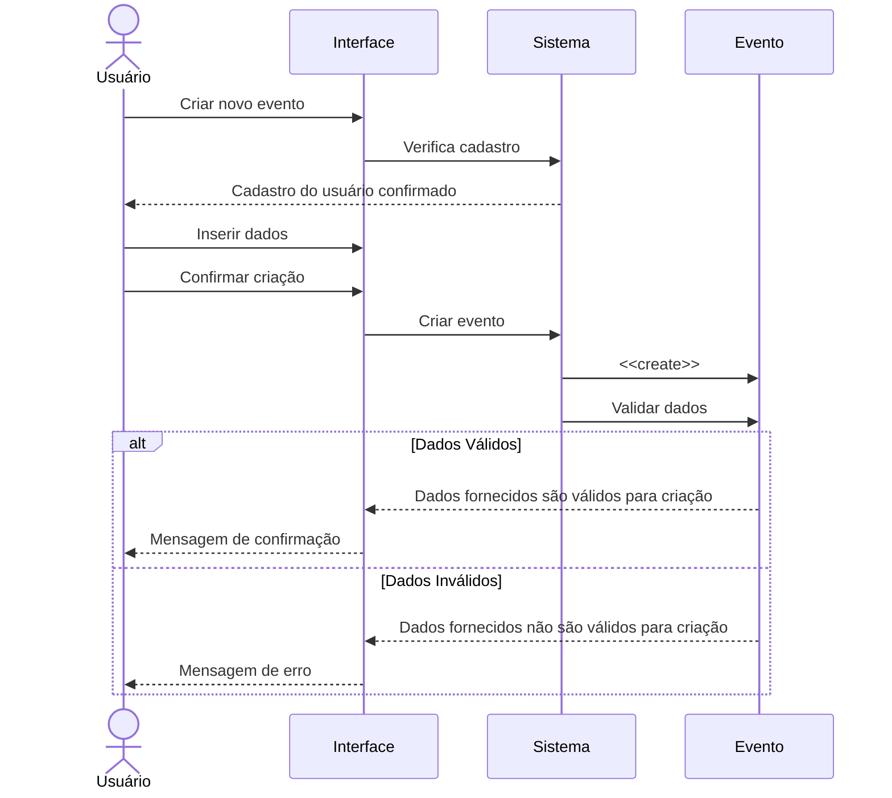

# Diagrama de Sequência

Este documento descreve o fluxo de comunicação e as interações extraídas do arquivo **"Diagrama de Sequência - Squad 2.pdf"**.

## Atores e Componentes (Lifelines)

* **Usuário (Ator):** Representa o usuário que interage com o sistema.
* **Interface:** A camada de visualização com a qual o usuário interage.
* **Sistema:** O backend ou controlador principal que processa as regras de negócio.
* **Evento:** A entidade/objeto que está sendo criada e validada.

## Fluxo de Passos

1. O **Usuário** interage com a **Interface** solicitando: `Criar novo evento`.
2. A **Interface** envia uma requisição para o **Sistema**: `Verifica cadastro`.
3. O **Sistema** processa a requisição e retorna para a Interface/Usuário: `Cadastro do usuário confirmado`.
4. O **Usuário** volta à **Interface** para `Inserir dados` do evento.
5. Em seguida, o **Usuário** clica na **Interface** para `Confirmar criação`.
6. A **Interface** envia o comando ao **Sistema** para `Criar evento`.
7. O **Sistema** envia uma mensagem de instanciação para a entidade **Evento**: `<<create>>`.
8. O **Sistema** solicita à entidade **Evento** para `Validar dados`.
9. **Retornos condicionais baseados na validação:**
   * **Cenário de Sucesso:** O Evento responde que os `Dados fornecidos são válidos para criação` e a Interface exibe uma `Mensagem de confirmação` ao Usuário.
   * **Cenário de Erro:** O Evento responde que os `Dados fornecidos não são válidos para criação` e a Interface exibe uma `Mensagem de erro` ao Usuário.

---

## Representação em Mermaid (Código Visual)

