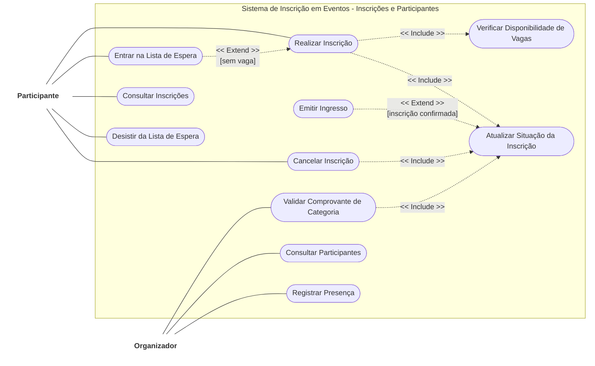

# Diagrama de Casos de Uso: Sistema de Inscrição em Eventos

**Escopo:** Sistema de Inscrição em Eventos - Inscrições e Participantes

# Atores

* **Participante:** Usuário que realiza e gerencia sua própria inscrição no evento.

* **Organizador:** Usuário responsável pela validação e controle dos participantes do evento.

# Casos de Uso por Ator

### Participante

O ator **Participante** se relaciona diretamente com os seguintes casos de uso:

* **Realizar Inscrição**

  * Inclui (`<<Include>>`) o caso de uso *Verificar Disponibilidade de Vagas*.

  * Inclui (`<<Include>>`) o caso de uso *Atualizar Situação da Inscrição*.

* **Entrar na Lista de Espera**

  * Estende (`<<Extend>>`) o caso de uso *Realizar Inscrição* sob a condição `[sem vaga]`.

* **Consultar Inscrições**

* **Desistir da Lista de Espera**

* **Cancelar Inscrição**

  * Inclui (`<<Include>>`) o caso de uso *Atualizar Situação da Inscrição*.

### Organizador

O ator **Organizador** se relaciona diretamente com os seguintes casos de uso:

* **Validar Comprovante de Categoria**

  * Inclui (`<<Include>>`) o caso de uso *Atualizar Situação da Inscrição*.

* **Consultar Participantes**

* **Registrar Presença**

## Casos de Uso Internos (Compartilhados / Sistema)

Esses casos de uso não possuem ligação direta com os atores, mas são acionados a partir de outros casos de uso através de relacionamentos de inclusão ou extensão:

* **Verificar Disponibilidade de Vagas:** Acionado sempre que uma inscrição é realizada.

* **Atualizar Situação da Inscrição:** Funciona como um ponto centralizado de atualização de status, sendo incluído por *Realizar Inscrição*, *Validar Comprovante de Categoria* e *Cancelar Inscrição*, e servindo como base de extensão para *Emitir Ingresso*.

* **Emitir Ingresso**

  * Estende (`<<Extend>>`) o caso de uso *Atualizar Situação da Inscrição* sob a condição `[inscrição confirmada]`.

## Código Mermaid

