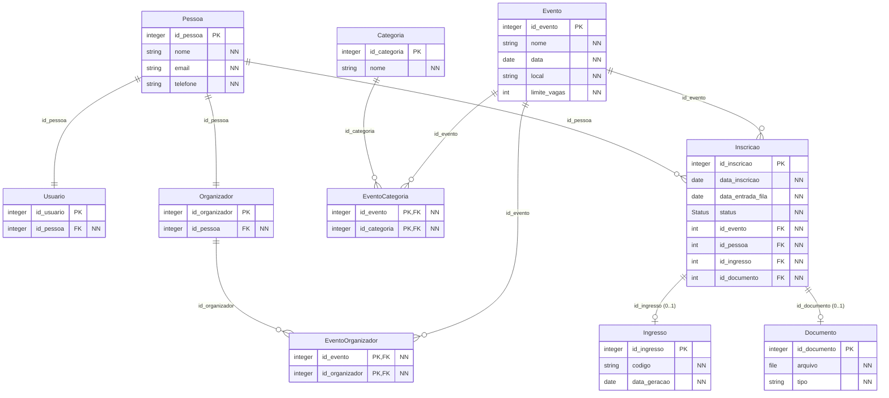

# Modelo de Dados / Diagrama de Classes: Sistema de Inscrição em Eventos

Este documento detalha as entidades, atributos, tipos de dados, restrições e relacionamentos do modelo de dados do sistema.

---

## 1. Entidades e Atributos

> **Legenda de Restrições:**
> * **PK:** Primary Key (Chave Primária)
> * **FK:** Foreign Key (Chave Estrangeira)
> * **NN:** Not Null (Preenchimento Obrigatório)

### 1.1. Pessoa
Armazena as informações cadastrais básicas comuns.
* `id_pessoa` (integer) - **PK**
* `nome` (string) - **NN**
* `email` (string) - **NN**
* `telefone` (string) - **NN**

### 1.2. Usuario
Representa a conta de acesso de um participante/usuário comum no sistema.
* `id_usuario` (integer) - **PK**
* `id_pessoa` (integer) - **FK**, **NN**

### 1.3. Organizador
Representa os privilégios/perfil de organizador associados a uma pessoa.
* `id_organizador` (integer) - **PK**
* `id_pessoa` (integer) - **FK**, **NN**

### 1.4. Evento
Guarda as informações fundamentais dos eventos cadastrados.
* `id_evento` (integer) - **PK**
* `nome` (string) - **NN**
* `data` (date) - **NN**
* `local` (string) - **NN**
* `limite_vagas` (int) - **NN**

### 1.5. EventoOrganizador *(Entidade Pivot / Associativa)*
Relaciona quais organizadores são responsáveis por quais eventos (Relacionamento N:N).
* `id_evento` (integer) - **PK**, **FK**, **NN**
* `id_organizador` (integer) - **PK**, **FK**, **NN**

### 1.6. Categoria
Categorias/tags atribuíveis aos eventos.
* `id_categoria` (integer) - **PK**
* `nome` (string) - **NN**

### 1.7. EventoCategoria *(Entidade Pivot / Associativa)*
Relaciona as categorias atribuídas a cada evento (Relacionamento N:N).
* `id_evento` (integer) - **PK**, **FK**, **NN**
* `id_categoria` (integer) - **PK**, **FK**, **NN**

### 1.8. Inscricao
Registra a participação de uma pessoa em um determinado evento.
* `id_inscricao` (integer) - **PK**
* `data_inscricao` (date) - **NN**
* `data_entrada_fila` (date) - **NN**
* `status` (Status / Enum) - **NN**
* `id_evento` (int) - **FK**, **NN**
* `id_pessoa` (int) - **FK**, **NN**
* `id_ingresso` (int) - **FK**, **NN**
* `id_documento` (int) - **FK**, **NN**

### 1.9. Ingresso
Guarda o bilhete/voucher de confirmação emitido para uma inscrição.
* `id_ingresso` (integer) - **PK**
* `codigo` (string) - **NN**
* `data_geracao` (date) - **NN**

### 1.10. Documento
Armazena comprovantes de categoria enviados pelo participante.
* `id_documento` (integer) - **PK**
* `arquivo` (file) - **NN**
* `tipo` (string) - **NN**

---

## 2. Relacionamentos e Cardinalidades

* **Pessoa (1) — (1) Usuario:** Uma pessoa possui no máximo um perfil de usuário.
* **Pessoa (1) — (1) Organizador:** Uma pessoa possui no máximo um perfil de organizador.
* **Organizador (1) — (*) EventoOrganizador (*) — (1) Evento:** Múltiplos organizadores podem gerenciar múltiplos eventos.
* **Categoria (1) — (*) EventoCategoria (*) — (1) Evento:** Um evento pode ter várias categorias e uma categoria pode estar em vários eventos.
* **Pessoa (1) — (*) Inscricao:** Uma pessoa pode realizar várias inscrições.
* **Evento (1) — (*) Inscricao:** Um evento pode conter várias inscrições.
* **Inscricao (1) — (0..1) Ingresso:** Uma inscrição pode ter no máximo um ingresso associado.
* **Inscricao (1) — (0..1) Documento:** Uma inscrição pode ter no máximo um documento de comprovação associado.

---

## 3. Código Mermaid

