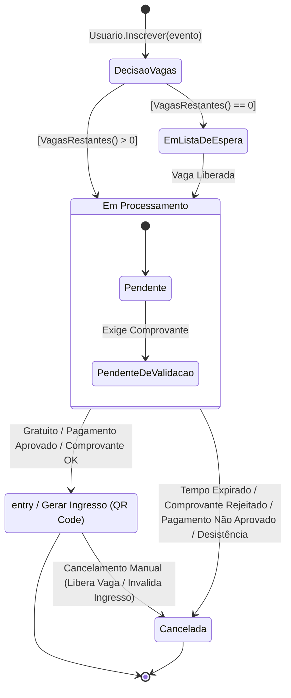

# Diagrama de Estados: Ciclo de Vida da Inscrição

Este documento mapeia os estados, transições, gatilhos e regras de negócio do fluxo de inscrição de um participante em um evento.

---

## 1. Mapeamento de Estados

| Estado | Descrição |
| :--- | :--- |
| **Ponto Inicial** | Início da solicitação de inscrição acionada pelo participante. |
| **EmListaDeEspera** | Estado em que a inscrição aguarda quando não há mais vagas disponíveis no momento da solicitação. |
| **Em Processamento** | Estado composto (macroestado) que engloba as etapas intermediárias de validação e verificação de pendências. |
| ↳ **Pendente** | Sub-estado inicial de *Em Processamento*. |
| ↳ **PendenteDeValidacao** | Sub-estado acionado caso o tipo de inscrição exija envio e validação de comprovante. |
| **Confirmada** | Estado final positivo. A inscrição foi aceita. Executa a ação: `entry / Gerar Ingresso (QR Code)`. |
| **Cancelada** | Estado final de interrupção da inscrição (seja por reprovação, término de prazo, desistência ou cancelamento manual). |
| **Ponto Final** | Encerramento do ciclo de vida da inscrição. |

---

## 2. Transições e Regras de Negócio

### 2.1. Entrada no Fluxo e Decisão de Vagas
* **Gatilho:** `Usuario.Inscrever(evento)`
* **Decisão / Guarda:**
  * Se `[VagasRestantes() == 0]` &rarr;  Transiciona para **EmListaDeEspera**.
  * Se `[VagasRestantes() > 0]` &rarr;  Transiciona para **Em Processamento** (entrando em **Pendente**).

### 2.2. Fila de Espera
* **De:** **EmListaDeEspera** &rarr;  **Em Processamento**
* **Evento/Gatilho:** `Vaga Liberada`

### 2.3. Transições Internas de Processamento
* **De:** **Pendente** &rarr;  **PendenteDeValidacao**
* **Gatilho:** `Exige Comprovante`

### 2.4. Finalização da Inscrição (Processamento)
* **Aprovação / Confirmação:**
  * **De:** **Em Processamento** &rarr;  **Confirmada**
  * **Condições:** `Gratuito / Pagamento Aprovado / Comprovante OK`
  * **Ação Interna:** Executa `entry / Gerar Ingresso (QR Code)` ao entrar no estado.

* **Rejeição / Cancelamento:**
  * **De:** **Em Processamento** &rarr;  **Cancelada**
  * **Condições:** `Tempo Expirado / Comprovante Rejeitado / Pagamento Não Aprovado / Desistência`

### 2.5. Alterações de Estado Pós-Confirmação
* **De:** **Confirmada** &rarr;  **Cancelada**
* **Gatilho e Ação:** `Cancelamento Manual (Libera Vaga / Invalida Ingresso)`

### 2.6. Encerramento
* **De:** **Confirmada** &rarr;  **Ponto Final**
* **De:** **Cancelada** &rarr;  **Ponto Final**

---

## 3. Código Mermaid

