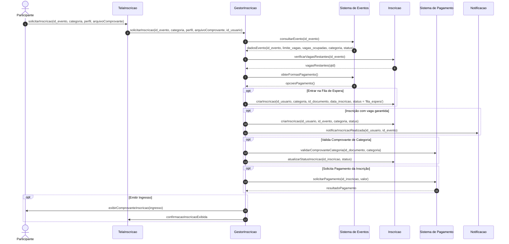

# Diagrama de Sequência: Realizar Inscrição

**Módulo:** Inscrições e Participantes
**Fluxo:** Solicitação e Processamento de Inscrição em Evento

---

## 1. Participantes (Lifelines)

| Nome | Tipo | Descrição |
| :--- | :--- | :--- |
| **Participante** | Ator | Usuário final que interage com o sistema para realizar a inscrição. |
| **TelaInscricao** | Interface / Fronteira | Camada de apresentação / interface com a qual o participante interage. |
| **GestorInscricao** | Controladora | Componente controlador responsável por orquestrar as regras de negócio da inscrição. |
| **Sistema de Eventos** | Serviço / Entidade | Módulo responsável pela gestão das informações gerais do evento. |
| **Inscricao** | Entidade | Objeto de domínio que armazena os dados do registro da inscrição. |
| **Sistema de Pagamento** | Serviço Externo / Integração | Gateway/Módulo responsável pelo processamento financeiro. |
| **Notificacao** | Serviço | Módulo responsável pelo envio de alertas e e-mails ao usuário. |

---

## 2. Detalhamento das Etapas e Mensagens

### 2.1. Solicitação e Consulta Inicial
1. `Participante` &rarr; `TelaInscricao`: `solicitarInscricao(id_evento, categoria, perfil, arquivoComprovante)`
2. `TelaInscricao` &rarr; `GestorInscricao`: `solicitarInscricao(id_evento, categoria, perfil, arquivoComprovante, id_usuario)`
3. `GestorInscricao` &rarr; `Sistema de Eventos`: `consultarEvento(id_evento)`
4. `Sistema de Eventos` &rarr; `GestorInscricao` (retorno): `dadosEvento(id_evento, limite_vagas, vagas_ocupadas, categoria, status)`
5. `GestorInscricao` &rarr; `Inscricao`: `verificarVagasRestantes(id_evento)`
6. `Inscricao` &rarr; `GestorInscricao` (retorno): `vagasRestantes(qtd)`
7. `GestorInscricao` &rarr; `Sistema de Eventos`: `obterFormasPagamento()`
8. `Sistema de Eventos` &rarr; `GestorInscricao` (retorno): `opcoesPagamento()`

---

### 2.2. Blocos Condicionais e Processamento

#### A. `[Entrar na Fila de Espera]`
* **Ação:** Se não houverem vagas disponíveis na consulta inicial.
* **Mensagem:** `GestorInscricao` &rarr; `Inscricao`:
  `criarInscricao(id_usuario, categoria, id_documento, data_inscricao, status = 'fila_espera')`

#### B. `[Inscrição com vaga garantida]`
* **Ação:** Caso existam vagas disponíveis.
* **Mensagens:**
  1. `GestorInscricao` &rarr; `Inscricao`: `criarInscricao(id_usuario, id_evento, categoria, status)`
  2. `GestorInscricao` &rarr; `Notificacao`: `notificarInscricaoRealizada(id_usuario, id_evento)`

#### C. `[Valida Comprovante de Categoria]`
* **Ação:** Para inscrições em categorias especiais que demandam comprovação (estudante, pne, etc.).
* **Mensagens:**
  1. `GestorInscricao` &rarr; `Sistema de Pagamento`: `validarComprovanteCategoria(id_documento, categoria)`
  2. `GestorInscricao` &rarr; `Inscricao`: `atualizarStatusInscricao(id_inscricao, status)`

#### D. `[Solicita Pagamento da Inscrição]`
* **Ação:** Para eventos ou categorias pagas.
* **Mensagens:**
  1. `GestorInscricao` &rarr; `Sistema de Pagamento`: `solicitarPagamento(id_inscricao, valor)`
  2. `Sistema de Pagamento` &rarr; `GestorInscricao` (retorno): `resultadoPagamento`

#### E. `[Emitir Ingresso]`
* **Ação:** Etapa final de confirmação e entrega do bilhete.
* **Mensagens:**
  1. `GestorInscricao` &rarr; `Participante`: `exibirComprovanteInscricao(ingresso)`
  2. `GestorInscricao` &rarr; `TelaInscricao`: `confirmacaoInscricaoExibida`

---

## 3. Código Mermaid

