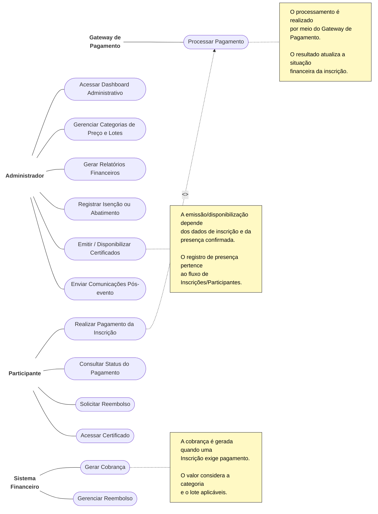

# Diagrama de Casos de Uso

O documento a seguir detalha a estrutura de interações dos usuários e sistemas representados no arquivo diagrama de casos de uso.jpg. 

*Nota: Os rótulos de texto dos atores originais não são visíveis na imagem. Foram inferidos nomes descritivos com base nas ações que cada perfil executa.*

## Diagrama Visual (Mermaid)

## Atores (Inferidos)

1. **Administrador (ou Organizador):** Responsável por configurações globais, gestão financeira e disparos de pós-evento.
2. **Gateway de Pagamento (ou Sistema Externo):** Responsável pela efetivação técnica da transação financeira.
3. **Participante (ou Inscrito):** O usuário final que realiza os pagamentos e consome o resultado da inscrição (status, certificado, etc).
4. **Sistema Financeiro (ou Módulo Interno):** Responsável pela geração primária da fatura e acompanhamento do ciclo de vida dos valores (cobrança e reembolso).

## Relacionamentos Principais

### Administrador
* Acessar Dashboard Administrativo
* Gerenciar Categorias de Preço e Lotes
* Gerar Relatórios Financeiros
* Registrar Isenção ou Abatimento
* Emitir / Disponibilizar Certificados
* Enviar Comunicações Pós-evento

### Gateway de Pagamento
* Processar Pagamento

### Participante
* Realizar Pagamento da Inscrição
* Consultar Status do Pagamento
* Solicitar Reembolso
* Acessar Certificado

### Sistema Financeiro
* Gerar Cobrança
* Gerenciar Reembolso

## Relacionamentos Especiais (Include)

* O caso de uso **Realizar Pagamento da Inscrição** inclui obrigatoriamente (`<<include>>`) a execução do caso de uso **Processar Pagamento**.

## Notas e Regras de Negócio

Conforme destacado nos quadros amarelos do diagrama original, as seguintes regras são aplicadas:

1. **Sobre a Geração de Cobrança (Referente a "Gerar Cobrança"):**
   * A cobrança é gerada quando uma Inscrição exige pagamento.
   * O valor considera a categoria e o lote aplicáveis.

2. **Sobre Certificados (Referente a "Emitir / Disponibilizar Certificados"):**
   * A emissão/disponibilização depende dos dados de inscrição e da presença confirmada.
   * O registro de presença pertence ao fluxo de Inscrições/Participantes.

3. **Sobre o Processamento (Referente a "Processar Pagamento"):**
   * O processamento é realizado por meio do Gateway de Pagamento.
   * O resultado atualiza a situação financeira da inscrição.