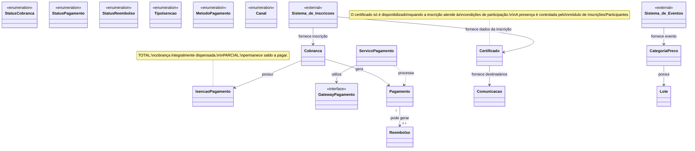

# Diagrama de Classes

O diagrama a seguir descreve a estrutura de classes, interfaces, enumerações e integrações externas do sistema, baseado no arquivo diagrama de classes.jpg. Os atributos internos das classes não foram listados pois constam apenas como marcações visuais na imagem de origem.

## Diagrama Visual (Mermaid)

## Elementos do Diagrama

### Enumerações (E)
Na parte superior do diagrama, encontram-se as seguintes enumerações utilizadas para tipificar os domínios do sistema:
* **StatusCobranca**
* **StatusPagamento**
* **StatusReembolso**
* **TipoIsencao**
* **MetodoPagamento**
* **Canal**

### Sistemas Externos (external)
Sistemas que fornecem dados para o domínio atual:
* **Sistema de Inscrições:** Fornece o contexto de inscrições para as cobranças e os dados dos participantes para os certificados.
* **Sistema de Eventos:** Fornece o contexto e as regras do evento para as categorias de preço.

### Classes (C) e Interfaces (I)
* **Cobranca:** Classe central de faturamento.
* **IsencaoPagamento:** Define regras ou registros de isenção aplicados a uma cobrança.
* **Pagamento:** Representa a transação financeira propriamente dita.
* **Reembolso:** Representa a devolução de um pagamento.
* **ServicoPagamento:** Classe responsável por orquestrar a lógica de processamento dos pagamentos.
* **GatewayPagamento (Interface):** Contrato para a integração com provedores de pagamento externos.
* **Certificado:** Representa o documento de participação.
* **Comunicacao:** Gerencia envios ou notificações.
* **CategoriaPreco:** Agrupa as regras de precificação baseadas no evento.
* **Lote:** Representa a disponibilidade e controle de vagas para uma determinada categoria de preço.

## Relacionamentos

* O **Sistema de Inscrições** tem dependência com **Cobranca** (fornece inscrição).
* O **Sistema de Inscrições** tem dependência com **Certificado** (fornece dados da inscrição).
* O **Sistema de Eventos** tem dependência com **CategoriaPreco** (fornece evento).
* A **Cobranca** possui associação com **IsencaoPagamento** (possui).
* A **Cobranca** gera instâncias de **Pagamento** (gera).
* O **ServicoPagamento** tem dependência/uso de **Pagamento** (processa).
* O **ServicoPagamento** utiliza a interface **GatewayPagamento** (utiliza).
* Um **Pagamento** (1) pode gerar zero ou um (0..1) **Reembolso** (pode gerar).
* O **Certificado** fornece informações para **Comunicacao** (fornece destinatários).
* A **CategoriaPreco** possui associação com **Lote** (possui).

## Notas e Regras de Negócio

Duas notas importantes estão atreladas aos componentes:

1. **Sobre Isenção (IsencaoPagamento / TipoIsencao):**
   * **TOTAL:** cobrança integralmente dispensada.
   * **PARCIAL:** permanece saldo a pagar.

2. **Sobre Emissão de Certificados (Certificado):**
   * O certificado só é disponibilizado quando a inscrição atende às condições de participação.
   * A presença é controlada pelo módulo de Inscrições/Participantes.