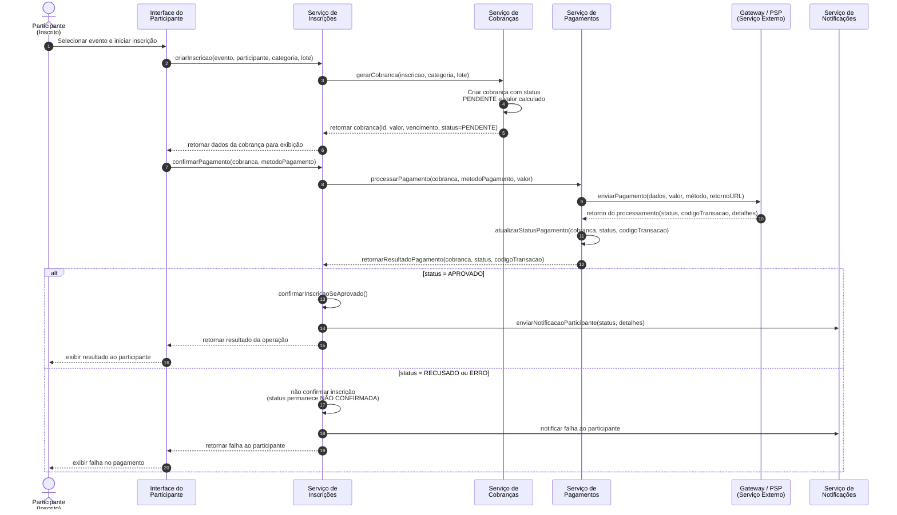

# Diagrama de Sequência — Pagamento de Inscrição

O documento a seguir descreve o fluxo de comunicação entre os sistemas e o usuário, baseado no arquivo Diagrama de sequência pagamento de inscrição.png.

## Diagrama Visual (Mermaid)

## Entidades Envolvidas

*   **Participante (Inscrito):** O usuário final que realiza a inscrição.
*   **Interface do Participante:** O frontend ou tela com o qual o usuário interage.
*   **Serviço de Inscrições:** Orquestrador principal do fluxo de registro no evento.
*   **Serviço de Cobranças:** Responsável pelo cálculo de valores e geração do registro financeiro pendente.
*   **Serviço de Pagamentos:** Responsável por intermediar a comunicação com as plataformas de pagamento externas.
*   **Gateway / PSP (Serviço Externo):** O provedor de pagamentos (cartão de crédito, Pix, boleto, etc).
*   **Serviço de Notificações:** Responsável pelo envio de e-mails, SMS ou avisos ao usuário.

## Passos do Fluxo

O fluxo síncrono e assíncrono é delineado pelos seguintes passos numerados, exatamente como no diagrama original:

1.  **Participante -> Interface do Participante:** Selecionar evento e iniciar inscrição
2.  **Interface do Participante -> Serviço de Inscrições:** `criarInscricao(evento, participante, categoria, lote)`
3.  **Serviço de Inscrições -> Serviço de Cobranças:** `gerarCobranca(inscricao, categoria, lote)`
4.  **Serviço de Cobranças -> Serviço de Cobranças:** Criar cobrança com status PENDENTE e valor calculado *(processamento interno)*
5.  **Serviço de Cobranças -> Serviço de Inscrições:** `retornar cobranca(id, valor, vencimento, status=PENDENTE)` *(retorno)*
6.  **Serviço de Inscrições -> Interface do Participante:** retornar dados da cobrança para exibição *(retorno)*
7.  **Interface do Participante -> Serviço de Inscrições:** `confirmarPagamento(cobranca, metodoPagamento)`
8.  **Serviço de Inscrições -> Serviço de Pagamentos:** `processarPagamento(cobranca, metodoPagamento, valor)`
9.  **Serviço de Pagamentos -> Gateway / PSP:** `enviarPagamento(dados, valor, método, retornoURL)`
10. **Gateway / PSP -> Serviço de Pagamentos:** `retorno do processamento(status, codigoTransacao, detalhes)` *(retorno)*
11. **Serviço de Pagamentos -> Serviço de Pagamentos:** `atualizarStatusPagamento(cobranca, status, codigoTransacao)` *(processamento interno)*
12. **Serviço de Pagamentos -> Serviço de Inscrições:** `retornarResultadoPagamento(cobranca, status, codigoTransacao)` *(retorno)*

## Fluxos Alternativos (Bloco "alt")

Após a resposta do Serviço de Pagamentos (passo 12), o sistema avalia o status da transação.

### Cenário 1: `[status = APROVADO]`

13. **Serviço de Inscrições -> Serviço de Inscrições:** `confirmarInscricaoSeAprovado()` *(processamento interno)*
14. **Serviço de Inscrições -> Serviço de Notificações:** `enviarNotificacaoParticipante(status, detalhes)`
15. **Serviço de Inscrições -> Interface do Participante:** retornar resultado da operação *(retorno)*
16. **Interface do Participante -> Participante:** exibir resultado ao participante *(retorno visual)*

### Cenário 2: `[status = RECUSADO ou ERRO]`

17. **Serviço de Inscrições -> Serviço de Inscrições:** não confirmar inscrição (status permanece NÃO CONFIRMADA) *(processamento interno)*
18. **Serviço de Inscrições -> Serviço de Notificações:** notificar falha ao participante
19. **Serviço de Inscrições -> Interface do Participante:** retornar falha ao participante *(retorno)*
20. **Interface do Participante -> Participante:** exibir falha no pagamento *(retorno visual)*