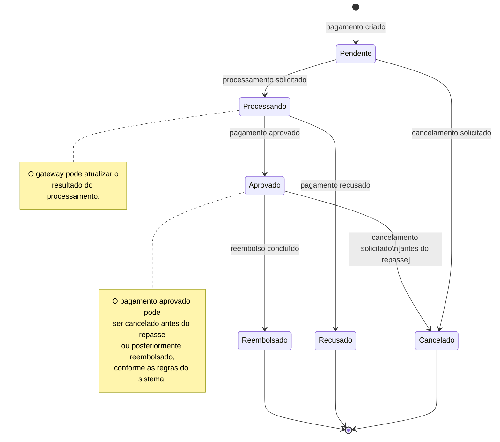

# Diagrama de Estados — Pagamento

O diagrama a seguir descreve o ciclo de vida e os estados de um pagamento no sistema, baseado no arquivo diaagrama de estados de pagamento.png.

## Diagrama Visual (Mermaid)

## Detalhamento dos Estados

Abaixo estão as descrições de cada estado conforme ilustrado no diagrama:

*   **Pendente**
    *   *Descrição:* Pagamento criado. Aguardando início do processamento.
*   **Processando**
    *   *Descrição:* Pagamento sendo processado pelo sistema ou gateway.
    *   *Nota:* O gateway pode atualizar o resultado do processamento.
*   **Aprovado**
    *   *Descrição:* Pagamento aprovado.
    *   *Nota:* O pagamento aprovado pode ser cancelado antes do repasse ou posteriormente reembolsado, conforme as regras do sistema.
*   **Recusado**
    *   *Descrição:* Pagamento recusado.
*   **Cancelado**
    *   *Descrição:* Pagamento cancelado.
*   **Reembolsado**
    *   *Descrição:* Reembolso concluído.

## Transições (Eventos)

A lista de eventos que disparam a mudanca de um estado para o outro:

1.  **[Início] -> Pendente:** pagamento criado
2.  **Pendente -> Processando:** processamento solicitado
3.  **Pendente -> Cancelado:** cancelamento solicitado
4.  **Processando -> Aprovado:** pagamento aprovado
5.  **Processando -> Recusado:** pagamento recusado
6.  **Aprovado -> Cancelado:** cancelamento solicitado [antes do repasse]
7.  **Aprovado -> Reembolsado:** reembolso concluído
8.  **Cancelado -> [Fim]**
9.  **Recusado -> [Fim]**
10. **Reembolsado -> [Fim]**